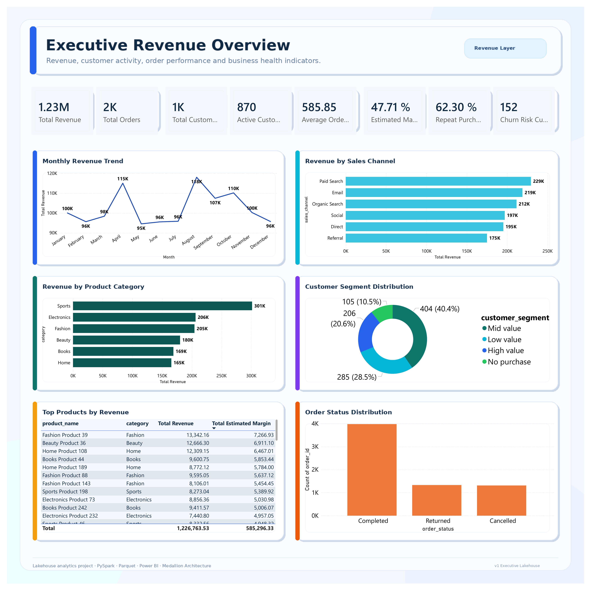
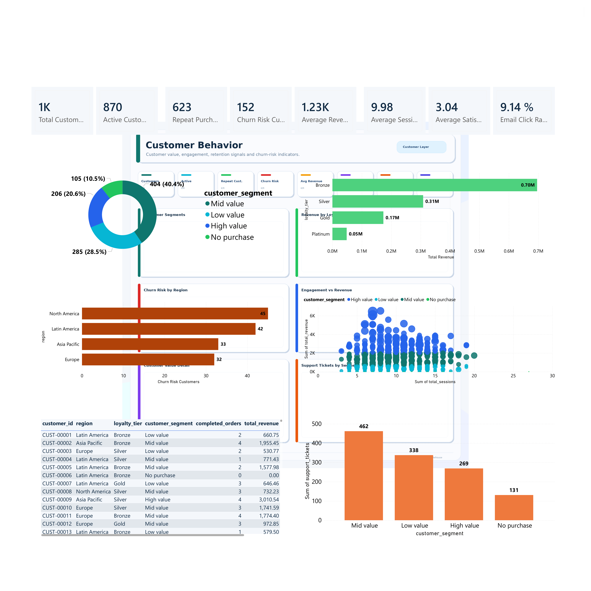
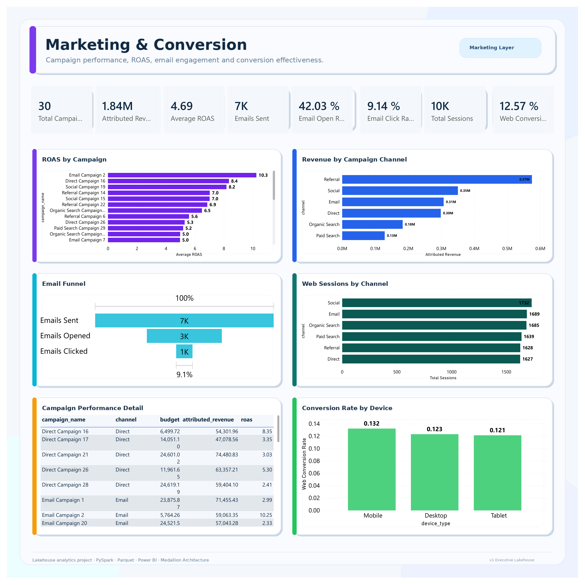
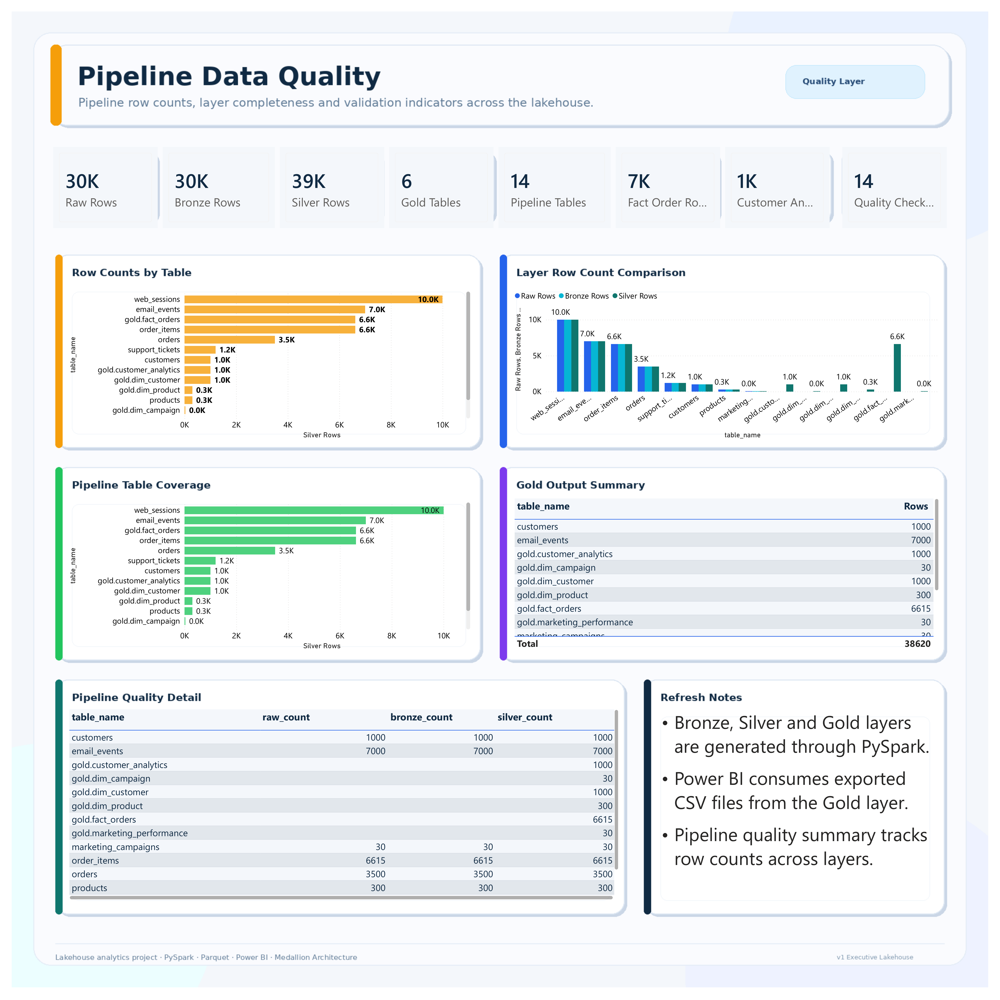

<h1 align="center">
  Customer & Sales Lakehouse Analytics Platform
</h1>

<p align="center">
  
  
  
  
  <br/>
  
  
  
  
</p>

<p align="center">
  A local lakehouse analytics platform that processes synthetic customer, sales, marketing, web behavior, and support data through Bronze, Silver, and Gold layers using Python, PySpark, Parquet, and Power BI.
</p>

<p align="center">
  <a href="#overview">Overview</a> ·
  <a href="#problem-statement">Problem Statement</a> ·
  <a href="#solution">Solution</a> ·
  <a href="#architecture">Architecture</a> ·
  <a href="#dashboard-preview">Dashboard</a> ·
  <a href="#how-to-run-locally">Run Locally</a>
</p>

---

## Overview

Customer and sales analytics often requires information from multiple operational domains: orders, products, customers, web sessions, marketing campaigns, email engagement, and customer support. When these datasets are handled separately, it becomes difficult to understand revenue performance, customer behavior, campaign effectiveness, and data quality across the full business workflow.

This project implements a local lakehouse-style analytics pipeline that consolidates synthetic retail and e-commerce data into structured analytical outputs. The pipeline follows a medallion architecture pattern with Bronze, Silver, and Gold layers, then exports business-ready datasets for Power BI reporting.

The dataset is fully synthetic and is designed to simulate realistic retail and e-commerce operations without exposing real customer, business, or transactional data.

---

## Problem Statement

Retail and e-commerce teams need reliable analytical datasets to monitor revenue, customer behavior, marketing conversion, and data quality. However, raw operational data often comes from different sources, with inconsistent structure, mixed data types, duplicates, missing values, and different levels of analytical readiness.

This project addresses the following problems:

- raw customer, order, marketing, web, and support data is not immediately ready for reporting;
- business metrics require consistent joins across multiple domains;
- customer-level analytics depends on aggregating behavioral, transactional, and support signals;
- marketing performance requires attributed revenue and campaign-level metrics;
- Power BI dashboards require clean, stable, and exportable datasets;
- pipeline quality needs to be monitored through row counts and layer validation.

The objective is to build a reproducible local data pipeline that transforms raw synthetic datasets into analytics-ready Gold tables and dashboard-ready CSV outputs.

---

## Solution

The platform generates synthetic retail and e-commerce data, processes it through PySpark, stores each layer as Parquet files, and exports the final Gold outputs as CSV files for Power BI.

The current implementation includes:

- synthetic data generation for customers, products, orders, order items, campaigns, web sessions, email events, and support tickets;
- Bronze ingestion from raw CSV files into Parquet;
- Silver cleaning, type casting, deduplication, and standardization;
- Gold modeling with dimensions, fact tables, customer analytics, and marketing performance outputs;
- pipeline quality summary with row counts across layers;
- Power BI export layer that converts Gold Parquet outputs into dashboard-ready CSV files;
- Power BI dashboard with four analytical pages;
- basic automated testing with Pytest.

---

## Architecture

```text
Synthetic Retail / E-commerce Data
        ↓
Raw CSV Layer
        ↓
Bronze Layer
Raw ingested data stored as Parquet
        ↓
Silver Layer
Cleaned, typed, standardized and deduplicated data
        ↓
Gold Layer
Fact tables, dimensions and analytical marts
        ↓
Power BI Export Layer
Dashboard-ready CSV files
        ↓
Power BI Dashboard
Revenue, customer, marketing and data quality insights
```

The pipeline is designed to remain simple enough to run locally, while still reflecting the structure of a modern lakehouse analytics workflow.

---

## Technology Stack

| Area | Tools |
|---|---|
| Data generation | Python, Faker, NumPy, Pandas |
| Data processing | PySpark |
| Storage format | CSV, Parquet |
| Analytical modeling | Spark DataFrames, fact tables, dimensions, marts |
| Data quality | Python, Pandas, row count validation |
| BI export | Pandas, CSV export |
| Dashboarding | Power BI Desktop |
| Testing | Pytest |
| Version control | Git, GitHub |

---

## Repository Structure

```text
customer-sales-lakehouse-analytics-platform/
│
├── README.md
├── requirements.txt
├── .gitignore
│
├── data/
│   ├── raw/
│   ├── bronze/
│   ├── silver/
│   ├── gold/
│   ├── powerbi/
│   └── sample/
│
├── docs/
│   ├── architecture.md
│   ├── data_dictionary.md
│   └── project_roadmap.md
│
├── scripts/
│   └── generate_synthetic_retail_data.py
│
├── src/
│   ├── bronze/
│   │   └── build_bronze.py
│   ├── silver/
│   │   └── build_silver.py
│   ├── gold/
│   │   └── build_gold.py
│   ├── quality/
│   │   └── run_quality_checks.py
│   ├── export/
│   │   └── export_gold_to_csv.py
│   └── utils/
│       ├── paths.py
│       └── spark.py
│
├── sql/
│   └── analytical_queries.sql
│
├── tests/
│   └── test_data_generation.py
│
├── notebooks/
│
└── powerbi/
    ├── customer_sales_lakehouse_dashboard.pbix
    └── screenshots/
        ├── executive_revenue_overview.png
        ├── customer_behavior.png
        ├── marketing_conversion.png
        └── pipeline_data_quality.png
```

---

## Data Sources

The project generates eight synthetic source datasets:

| Dataset | Description |
|---|---|
| `customers.csv` | Customer profile, region, acquisition channel, signup date, loyalty tier and activity flag |
| `products.csv` | Product catalog, category, brand, cost, list price and active flag |
| `marketing_campaigns.csv` | Campaign metadata, channel, dates, budget and target region |
| `orders.csv` | Order header data, customer, date, status, channel, campaign and payment method |
| `order_items.csv` | Order line items, product, quantity, price, discount and net amount |
| `web_sessions.csv` | Web behavior, channel, device type, pages viewed, session duration and conversion flag |
| `email_events.csv` | Email campaign events, sent, opened, clicked and unsubscribed flags |
| `support_tickets.csv` | Customer support tickets, category, status, priority and satisfaction score |

The synthetic data is generated locally and is not committed to the repository by default.

---

## Data Pipeline

### 1. Raw Layer

The raw layer stores synthetic CSV files generated by:

```bash
python scripts/generate_synthetic_retail_data.py
```

Expected raw outputs:

```text
data/raw/customers.csv
data/raw/products.csv
data/raw/marketing_campaigns.csv
data/raw/orders.csv
data/raw/order_items.csv
data/raw/web_sessions.csv
data/raw/email_events.csv
data/raw/support_tickets.csv
```

### 2. Bronze Layer

The Bronze layer ingests raw CSV files and writes them as Parquet tables with minimal transformation.

```bash
python -m src.bronze.build_bronze
```

Bronze outputs are stored in:

```text
data/bronze/
```

### 3. Silver Layer

The Silver layer standardizes schemas, casts data types, parses dates and timestamps, and removes duplicate records.

```bash
python -m src.silver.build_silver
```

Silver outputs are stored in:

```text
data/silver/
```

### 4. Gold Layer

The Gold layer creates business-ready datasets for analytics and reporting.

```bash
python -m src.gold.build_gold
```

Gold outputs are stored in:

```text
data/gold/
```

Current Gold outputs:

| Gold table | Purpose |
|---|---|
| `dim_customer` | Customer dimension |
| `dim_product` | Product dimension |
| `dim_campaign` | Campaign dimension |
| `fact_orders` | Order-level analytical fact table |
| `fact_web_sessions` | Web session fact output |
| `fact_email_events` | Email engagement fact output |
| `fact_support_tickets` | Support ticket fact output |
| `customer_analytics` | Customer-level behavioral and revenue mart |
| `marketing_performance` | Campaign-level performance and ROAS mart |

### 5. Data Quality Layer

The quality layer creates a row count summary across raw, Bronze, Silver and selected Gold outputs.

```bash
python -m src.quality.run_quality_checks
```

Output:

```text
data/gold/pipeline_quality_summary.csv
```

### 6. Power BI Export Layer

The export layer converts Gold Parquet outputs into CSV files that can be loaded directly into Power BI.

```bash
python -m src.export.export_gold_to_csv
```

Power BI outputs are stored in:

```text
data/powerbi/
```

Exported files:

```text
dim_customer.csv
dim_product.csv
dim_campaign.csv
fact_orders.csv
fact_web_sessions.csv
fact_email_events.csv
fact_support_tickets.csv
customer_analytics.csv
marketing_performance.csv
pipeline_quality_summary.csv
powerbi_export_manifest.json
```

---

## Analytical Model

The Gold layer combines dimensional modeling and analytical marts.

```text
dim_customer
      ↓
fact_orders
      ↑
dim_product
      ↑
dim_campaign
```

Additional analytical outputs support customer behavior, marketing performance, web conversion, support monitoring and pipeline quality.

### Core Analytical Outputs

| Output | Description |
|---|---|
| `fact_orders` | Revenue, order status, product, customer, campaign, channel and estimated margin |
| `customer_analytics` | Customer-level revenue, sessions, email engagement, support tickets, segment and churn-risk flag |
| `marketing_performance` | Campaign-level attributed orders, attributed revenue, budget and ROAS |
| `pipeline_quality_summary` | Row count monitoring across the pipeline |

---

## Dashboard Preview

The Power BI dashboard contains four pages that summarize revenue, customers, marketing conversion and pipeline quality.

### Executive Revenue Overview

This page tracks revenue performance, order volume, customer base, average order value, margin rate, repeat purchase rate, churn-risk customers, sales channels, product categories and top revenue-generating products.



### Customer Behavior

This page analyzes customer segments, loyalty tiers, churn-risk distribution, engagement versus revenue, customer-level value and support ticket distribution.



### Marketing & Conversion

This page summarizes campaign performance, attributed revenue, ROAS, email funnel performance, web sessions by channel and conversion rate by device type.



### Pipeline Data Quality

This page monitors the data pipeline through raw, Bronze, Silver and Gold row counts, table coverage, Gold output summaries and refresh notes.



---

## Key Metrics

### Revenue and Orders

| Metric | Description |
|---|---|
| Total Revenue | Completed-order revenue |
| Total Orders | Distinct completed orders |
| Average Order Value | Revenue divided by completed orders |
| Estimated Margin Rate | Estimated margin divided by revenue |
| Completed Orders Rate | Completed orders divided by all orders |

### Customer Behavior

| Metric | Description |
|---|---|
| Total Customers | Distinct customer count |
| Active Customers | Customers marked as active |
| Repeat Purchase Customers | Customers with more than one completed order |
| Repeat Purchase Rate | Repeat customers divided by total customers |
| Churn Risk Customers | Customers flagged through behavioral and support signals |
| Average Revenue per Customer | Customer-level revenue average |
| Average Sessions per Customer | Average customer web sessions |
| Average Satisfaction Score | Average support satisfaction score |

### Marketing and Conversion

| Metric | Description |
|---|---|
| Total Campaigns | Distinct marketing campaigns |
| Attributed Revenue | Revenue attributed to campaigns |
| Average ROAS | Average campaign return on ad spend |
| Email Open Rate | Opened emails divided by sent emails |
| Email Click Rate | Clicked emails divided by sent emails |
| Web Conversion Rate | Converted web sessions divided by total web sessions |

### Pipeline Quality

| Metric | Description |
|---|---|
| Raw Rows | Total rows generated in the raw layer |
| Bronze Rows | Total rows written to Bronze |
| Silver Rows | Total rows written to Silver and selected Gold outputs |
| Pipeline Tables | Number of tables tracked in the quality summary |
| Gold Tables | Number of Gold outputs tracked in the quality summary |
| Quality Checks | Number of records in the pipeline quality summary |

---

## How to Run Locally

### 1. Clone the repository

```bash
git clone https://github.com/JosiasCH/customer-sales-lakehouse-analytics-platform.git
cd customer-sales-lakehouse-analytics-platform
```

### 2. Create and activate a virtual environment

```bash
python -m venv .venv
```

On Windows PowerShell:

```powershell
.venv\Scripts\activate
```

### 3. Install dependencies

```bash
pip install -r requirements.txt
```

### 4. Generate synthetic data

```bash
python scripts/generate_synthetic_retail_data.py
```

Expected output includes:

```text
customers.csv
products.csv
marketing_campaigns.csv
orders.csv
order_items.csv
web_sessions.csv
email_events.csv
support_tickets.csv
```

### 5. Build Bronze layer

```bash
python -m src.bronze.build_bronze
```

### 6. Build Silver layer

```bash
python -m src.silver.build_silver
```

### 7. Build Gold layer

```bash
python -m src.gold.build_gold
```

### 8. Run pipeline quality checks

```bash
python -m src.quality.run_quality_checks
```

### 9. Export Gold outputs for Power BI

```bash
python -m src.export.export_gold_to_csv
```

### 10. Run tests

```bash
pytest
```

---

## Power BI Usage

Open the Power BI report file:

```text
powerbi/customer_sales_lakehouse_dashboard.pbix
```

The dashboard is designed to consume CSV outputs from:

```text
data/powerbi/
```

If the data is regenerated, run the pipeline again and refresh the Power BI report.

Recommended refresh flow:

```bash
python scripts/generate_synthetic_retail_data.py
python -m src.bronze.build_bronze
python -m src.silver.build_silver
python -m src.gold.build_gold
python -m src.quality.run_quality_checks
python -m src.export.export_gold_to_csv
```

Then refresh the Power BI model.

---

## Windows Notes for Local PySpark

For local execution on Windows, PySpark requires a compatible Java installation. This project is tested with Java 17.

Recommended Java setup:

```text
JAVA_HOME → JDK 17
```

Some Windows environments may also require Hadoop native utilities for local Spark file operations:

```text
C:\hadoop\bin\winutils.exe
C:\hadoop\bin\hadoop.dll
```

These files are not included in the repository. They are environment-specific and should be configured locally if Spark fails to write Parquet outputs on Windows.

---

## Testing

The project includes an initial Pytest validation that checks whether the synthetic data generation process creates the expected source files.

Run:

```bash
pytest
```

Expected result:

```text
1 passed
```

---

## Data Privacy

This project uses synthetic data only.

The repository does not contain real customer data, real company data, real orders, real campaigns, real support tickets or confidential business information. The data generation process is designed to simulate realistic analytical patterns without representing actual individuals or organizations.

Generated datasets and local pipeline outputs are ignored by Git to avoid committing unnecessary or large generated files.

---

## Current Status

Completed:

- [x] Synthetic retail and e-commerce data generation
- [x] Raw CSV layer
- [x] Bronze Parquet ingestion
- [x] Silver cleaning and standardization
- [x] Gold dimensional and analytical outputs
- [x] Customer analytics mart
- [x] Marketing performance mart
- [x] Pipeline quality summary
- [x] Power BI export layer
- [x] Four-page Power BI dashboard
- [x] Dashboard screenshots for documentation
- [x] Basic Pytest validation

Planned improvements:

- [ ] Add Delta Lake support
- [ ] Add Databricks notebook version
- [ ] Add orchestration with Airflow
- [ ] Add dbt version for SQL-based transformations
- [ ] Add GitHub Actions validation workflow
- [ ] Expand data quality checks beyond row counts
- [ ] Add incremental loading logic
- [ ] Add Power BI Service deployment notes
- [ ] Add a production-style data lineage diagram

---

## Future Improvements

Possible extensions include:

- replacing local Parquet outputs with Delta Lake tables;
- adding a Databricks implementation of the Bronze, Silver and Gold pipeline;
- adding dbt models for the Gold layer;
- orchestrating the full workflow with Airflow;
- implementing incremental ingestion and partitioned outputs;
- adding schema validation and anomaly checks;
- publishing dashboard refresh documentation;
- extending the customer churn-risk logic with additional behavioral features.

---

## License

This project is intended for educational and technical demonstration purposes. The dataset is synthetic and does not represent real customers, companies, transactions, campaigns or support records.
